# Weather

Realtime Weather App

## How does it work?
App uses the location service from your device and get data from https://www.weatherapi.com/ and show it on app.

## Packages Used

  - dio: 3.0.9
  - geolocator: 5.3.2+2
  - location: 3.0.2
  - provider: 4.1.3
  
## API
Get your own api key from https://www.weatherapi.com/ and paste it inside all the file of lib/Provider/. Paste the api key in a variable below the comments(See file yourself).

## Features

 - Realtime Weather Data
 - upto 3 day forecast
 - Search any city to show weather data
 - Beautiful & Minimal UI
 - Request for location permission

## Screenshots
  

  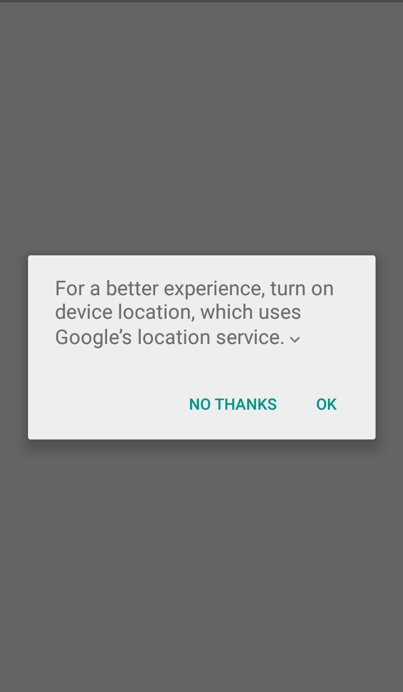
 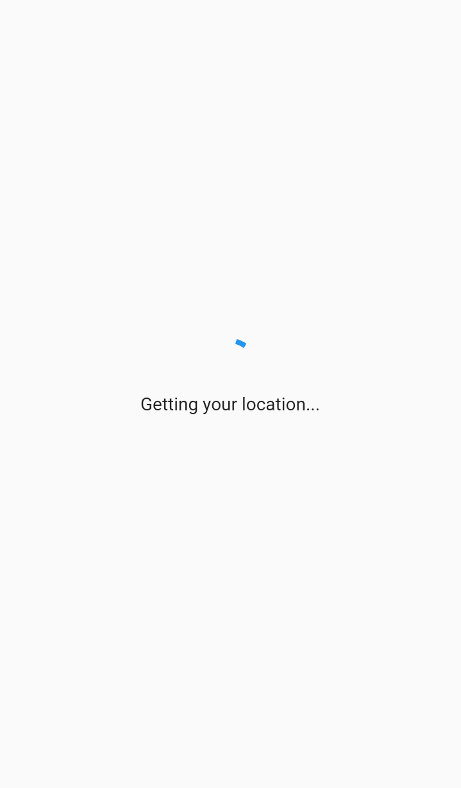
  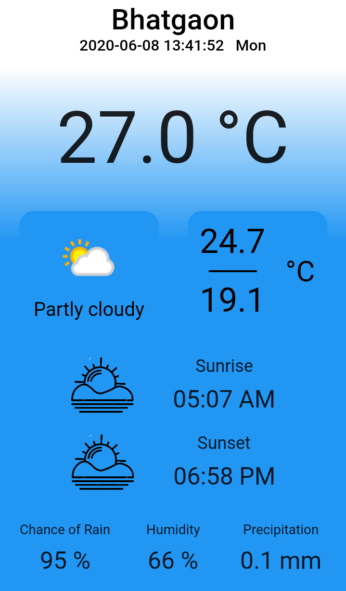
  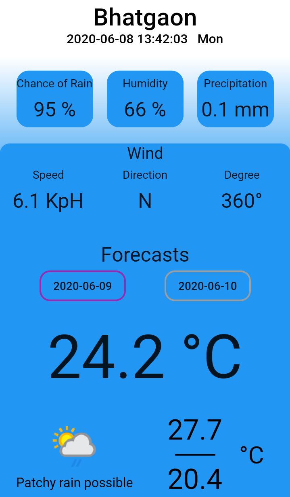
  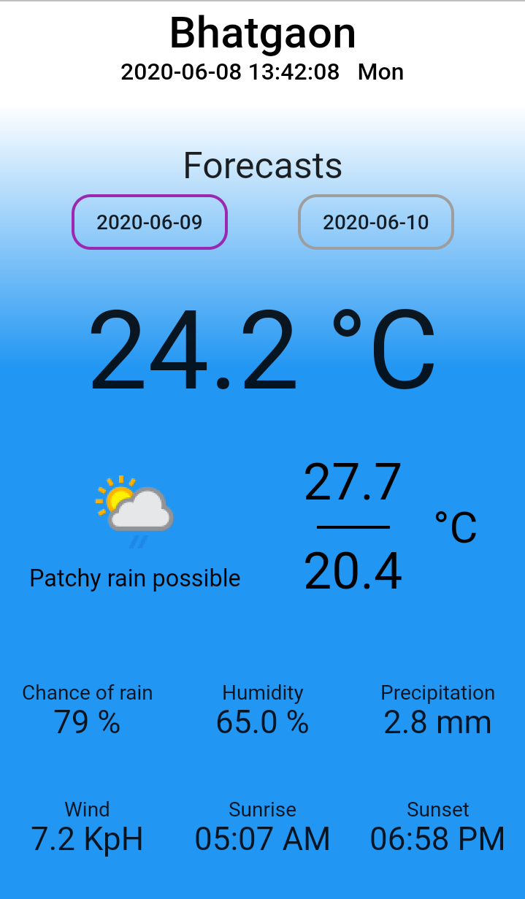
 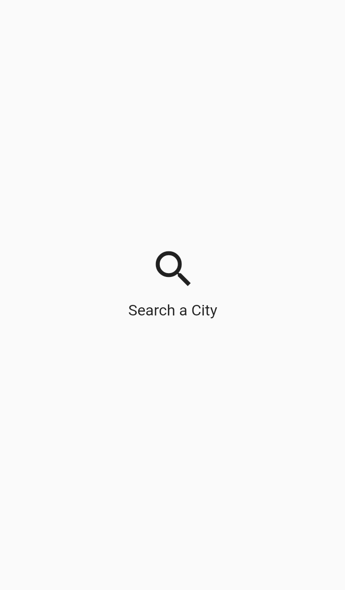
   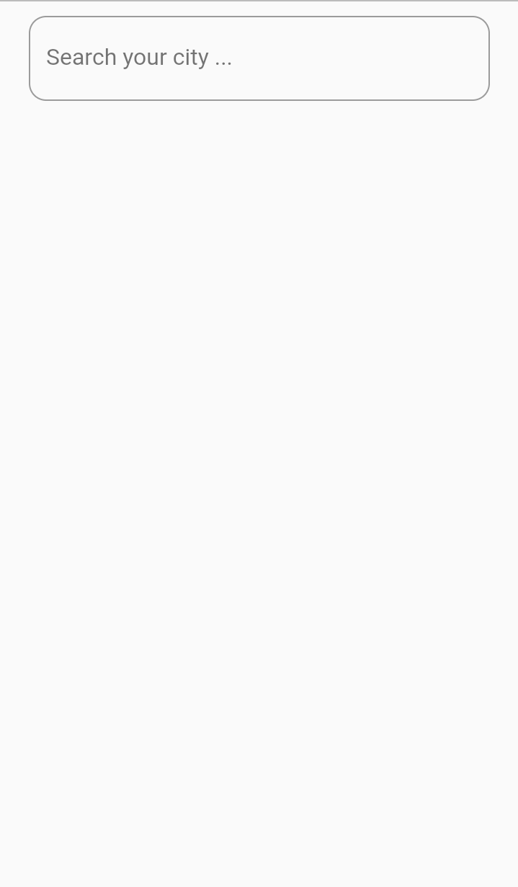
   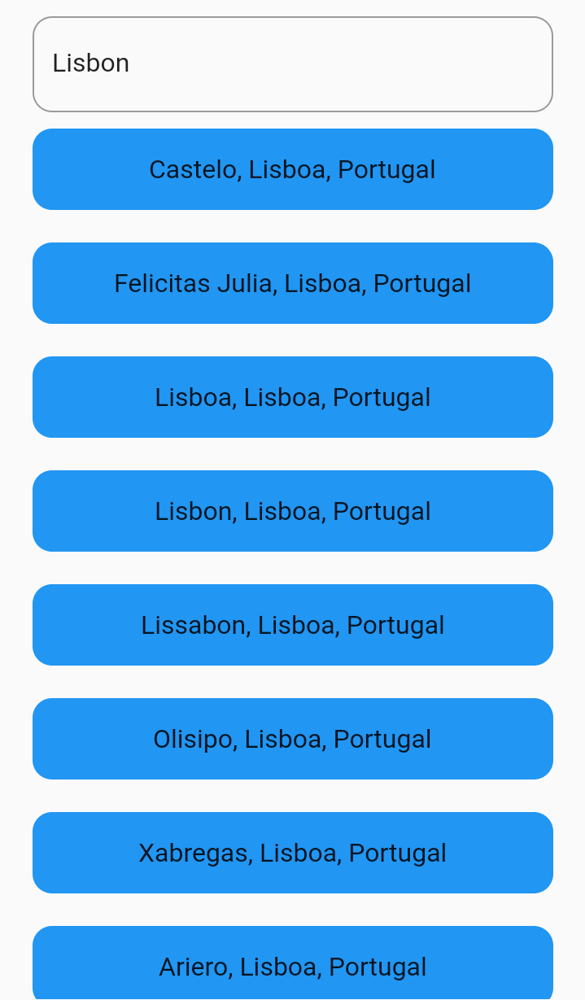
  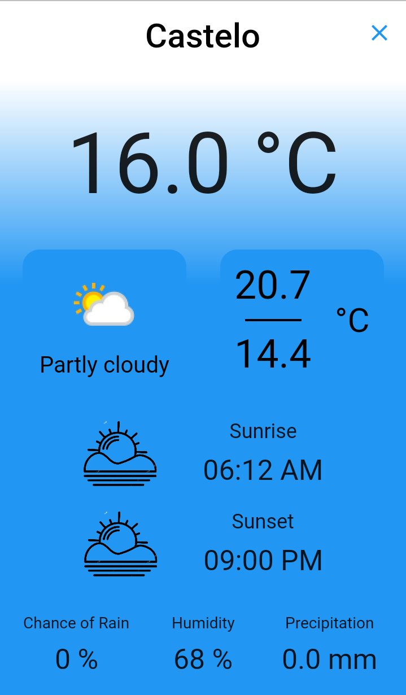
    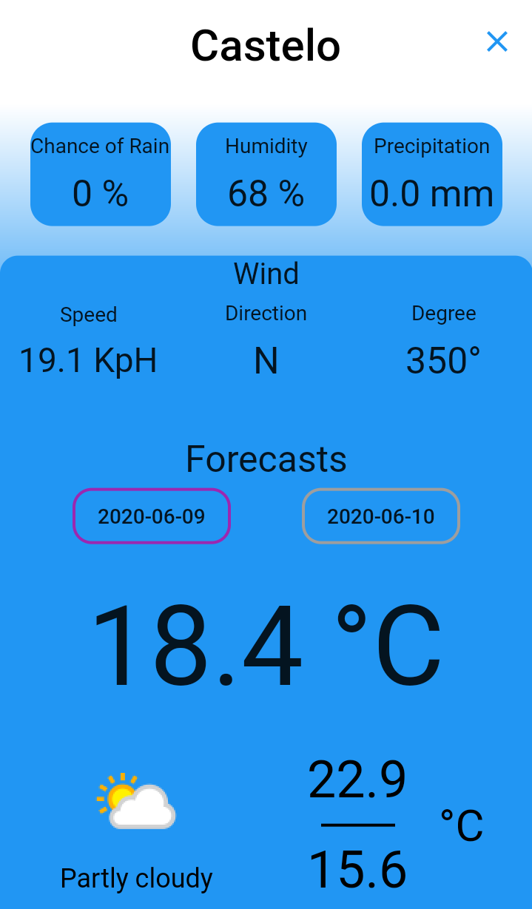
    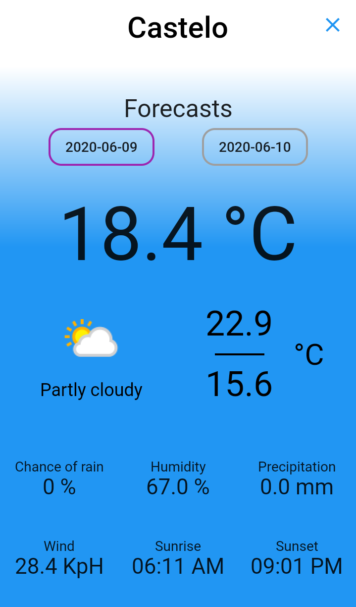

